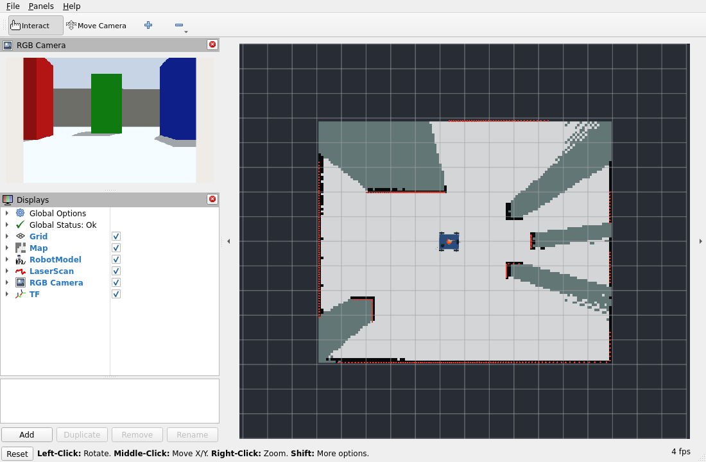
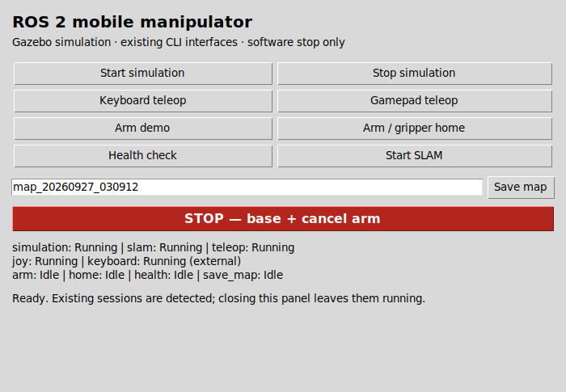
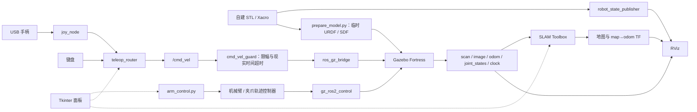

# ROS 2 移动机械臂仿真

> **项目定位：AI 辅助的探索性学习实践。** 本项目围绕自建 SolidWorks 机器人模型，在 AI 帮助下逐步搭建 ROS 2 仿真系统与自动化测试，尝试理解 ROS 2 的开发、集成与仿真思路。学习目标也包括工程化测试的流程与深度：从功能运行、单元测试和集成检查，到异常场景、回归验证、结果记录及其适用边界；同时练习按工程文档的形式整理问题、方案和验证依据。

本项目使用 **OpenAI Codex 辅助开发**，参与范围包括 ROS 2 集成代码、调试、自动化测试、GUI、运行检查、代码修改和文档编写。作者负责需求提出、CAD 建模、集成方案选择与复核，并进行仿真操作、手柄测试和最终人工验收；在这一过程中逐步学习相关原理与实现。代码并非全部独立手写，项目完成也不意味着作者已独立掌握其中全部技术。

**本仓库主要记录学习过程、当前实现和已有验证，不应仅凭功能、代码量或文档完整度，将其视为作者独立开发、编程能力或成熟工程交付能力的证明。** 后文的测试结果描述特定环境和场景下的系统表现，工程文档属于学习与写作练习。机器人运动与定量结果均来自 Gazebo，尚未进行真实机器人实验。

基于 **ROS 2 Humble、Gazebo Fortress 和 Python** 的移动机械臂仿真。机器人由四轮 skid-steer 底盘、J1–J4 四关节机械臂、平行夹爪、2D LiDAR 和 RGB 相机构成。

目前可以通过键盘或 USB Nintendo Pro Controller 遥操作底盘，运行机械臂与夹爪演示，使用 SLAM Toolbox 建图并保存地图。提供一个 Tkinter 操作面板和基础自动化检查。

使用 USB 手柄测试了仿真机器人的运动和停止，目前还没有做实物机器人、抓取或载荷实验。项目不包含 Nav2、MoveIt、自动探索或路径规划。

## 仿真画面

RViz 中的机器人模型、TF、激光扫描、相机画面与 SLAM 地图：



轻量操作面板：



截图来自项目实际运行。当前地图仍有未知区域和遮挡，未完成整间房的完整覆盖。

## 已验证环境

| 项目 | 环境或配置 |
| --- | --- |
| 操作系统 | Ubuntu 22.04，VMware 虚拟机 |
| ROS 2 / Python | Humble / Python 3.10 |
| 仿真 | Gazebo Fortress 6.18.0 |
| 仿真桥接 | `ros_gz_sim`、`ros_gz_bridge` |
| 控制 | `gz_ros2_control` 0.7.21、JointTrajectoryController 2.54.0 |
| 建图与显示 | SLAM Toolbox 2.6.10、RViz 2 |
| GUI | Python Tkinter |

这是开发和测试时使用的环境。其他版本没有逐一测试，也还没有在全新虚拟机上重新走完安装流程。

## 机器人模型

| 部分 | 当前实现 |
| --- | --- |
| 底盘 | 约 0.40 × 0.30 m，四轮 skid-steer；轮半径 0.05 m，轮距 0.35 m |
| 机械臂 | J1 绕竖直轴旋转，J2–J4 为俯仰关节 |
| 夹爪 | 两个移动副 jaw，开口约 20–50 mm；两个关节接收相同目标并分别校验 |
| STL | 10 个自行建模的文件，`scale=0.001` 将毫米转换为米 |
| LiDAR | 仿真激光扫描，360 个采样点，仿真时间下配置为 10 Hz |
| 相机 | 320 × 240 RGB 图像，仿真时间下配置为 10 Hz |

机械臂和夹爪都使用 **JointTrajectoryController**。机械臂采用 position 命令接口，夹爪采用 effort/PID 跟踪位置目标。夹爪没有移除轨迹控制器。

LiDAR 外观使用圆柱体，相机使用盒体和圆柱体；没有打包来源不明的标准件 CAD。惯量与碰撞几何有估算和简化。

## 安装与启动

以下假定已安装 [ROS 2 Humble desktop](https://docs.ros.org/en/humble/Installation/Ubuntu-Install-Debs.html) 和 Gazebo Fortress，并配置对应软件源。仿真控制插件的版本配套说明见 [gz_ros2_control Humble 文档](https://control.ros.org/humble/doc/gz_ros2_control/doc/index.html)。

获取源码：

```bash
git clone https://github.com/iori-shino/ros2-mobile-manipulator.git ~/robot_ws
cd ~/robot_ws
```

安装构建、控制、遥操作和测试工具：

```bash
sudo apt update
sudo apt install python3-colcon-common-extensions python3-rosdep python3-pytest \
  python3-tk python3-yaml python3-pil gnome-terminal \
  ros-humble-ros-gz ros-humble-gz-ros2-control ros-humble-ign-ros2-control \
  ros-humble-ros2-controllers ros-humble-slam-toolbox ros-humble-joy \
  ros-humble-teleop-twist-joy ros-humble-joint-state-publisher-gui
```

如果机器尚未初始化 rosdep，先执行一次 `sudo rosdep init`。然后在仓库根目录检查依赖并构建：

```bash
source /opt/ros/humble/setup.bash
rosdep update
rosdep install --from-paths src --ignore-src --rosdistro humble -r -y
colcon build --symlink-install
source install/setup.bash
```

新终端需要重新加载 ROS 和工作空间环境。以下命令默认在仓库根目录运行。

启动房间仿真、SLAM 和 RViz：

```bash
ros2 launch mobile_manipulator_gazebo mapping_demo.launch.py
```

启动后通过遥操作驾驶，系统不会自动探索。已有仿真或 SLAM 节点运行时，不要重复启动整组演示。

也可以单独启动：

```bash
# 只启动仿真
ros2 launch mobile_manipulator_gazebo sim.launch.py

# 只查看模型与 TF
ros2 launch mobile_manipulator_description display.launch.py
```

模型展示模式的 joint-state 发布不要与物理仿真同时运行。

## 键盘与手柄控制

启动统一遥操作节点和 USB 输入驱动：

```bash
ros2 launch mobile_manipulator_gazebo teleop.launch.py
```

如果已有 `joy_node`，使用 `start_joy:=false`；没有手柄时使用 `keyboard_only:=true`。不要并行运行多个持续发布 `/cmd_vel` 的控制工具。

### 键盘

在另一个交互终端中加载环境后运行：

```bash
ros2 run mobile_manipulator_gazebo teleop_keyboard.py
```

| 按键 | 动作 |
| --- | --- |
| W / S | 前进 / 后退 |
| A / D | 左转 / 右转 |
| 空格 | 停止 |
| Q / Ctrl+C | 停止并退出 |

按住或重复按键保持运动。键盘线速度为 0.04 m/s，角速度为 0.3 rad/s。终端没有 key-up 事件，松键后通过 0.30 秒现实时间超时停止；首次长按可能受操作系统按键重复延迟影响。

### USB 手柄

下面是 **Nintendo Co., Ltd. Pro Controller** 的实际 `/joy` 标定结果，axis/button 均从 0 开始编号：

| 输入 | 索引与方向 |
| --- | --- |
| 左摇杆水平 / 垂直 | axes 0 / 1，向左 / 向上为正 |
| 右摇杆水平 / 垂直 | axes 2 / 3，已记录，未用于底盘控制 |
| A / B / X / Y | buttons 1 / 0 / 2 / 3 |
| L / R | buttons 5 / 6 |
| ZL / ZR | buttons 7 / 8 |
| − / + | buttons 9 / 10 |

**先松开 L、让左摇杆回中，再按住 L 使能，推动左摇杆控制底盘。松开 L 停止，B 为独立停止键。**

手柄最大线速度为 **0.05 m/s = 3 m/min**，最大角速度为 0.4 rad/s。驱动死区为 0.05，router 额外死区为 0.15；输入超时为 0.30 秒现实时间。下游 guard 另保留速度限幅和 0.5 秒现实时间超时停车。

按住手柄使能键时，手柄优先于键盘运动键；键盘空格可以停止任一输入。

映射会随设备和驱动变化。需要重新标定本款手柄时，先运行 `ros2 run joy joy_node`，再执行：

```bash
python3 tools/acceptance/joy_calibrate.py
```

该脚本只读取 `/joy`，按标注步骤生成 Gazebo 包中的 `config/teleop_mapping.yaml`，修改后需重新构建。脚本明确指定了这款设备，并按按钮形式处理扳机；其他手柄需先检查设备名与扳机类型，不能直接套用 Xbox、PS 或通用 Switch 映射。

## 机械臂、夹爪与操作面板

现有命令接口：

```bash
ros2 run mobile_manipulator_gazebo arm_control.py J2 0.4
ros2 run mobile_manipulator_gazebo arm_control.py open
ros2 run mobile_manipulator_gazebo arm_control.py close
ros2 run mobile_manipulator_gazebo arm_control.py home
```

`arm_control.py demo` 执行已验证的完整关节与夹爪演示，在慢速虚拟机中可能需要数分钟，不作为日常健康检查。未测试抓取物体或载荷。

从已构建的仓库根目录启动 GUI：

```bash
ros2 run mobile_manipulator_gazebo robot_panel.py --workspace "$PWD"
```

面板提供仿真启动/停止、键盘/手柄遥操作、机械臂 demo、回零、健康检查、SLAM、保存地图和 STOP 入口。底层调用已有 launch、脚本和 ROS 接口。

关闭面板后，ROS 会话继续运行。面板只停止自己启动或已验证归属的会话；外部进程需要在原终端结束。停止仿真前应先保存需要保留的地图。

**STOP 是软件命令停止**：底盘零速仍经过原 guard，并请求取消机械臂/夹爪动作。它不是锁存式硬件急停，新指令可以恢复运动。详细操作见 [GUI.md](docs/GUI.md)。

GUI 需要图形桌面，键盘按钮使用 GNOME Terminal；命令行可以独立使用。

## 节点与通信



键盘和手柄由同一个 router 仲裁，再经过原底盘安全链。仿真传感器、控制器和 SLAM 使用仿真时间，输入与命令失效停车使用现实时间。

## SLAM 与地图保存

如果仿真已在运行，可以单独启动 SLAM：

```bash
ros2 launch mobile_manipulator_gazebo slam.launch.py
ros2 run mobile_manipulator_gazebo save_slam_map.py maps/generated/demo_room
```

每次保存使用新名称，已有地图不会被覆盖。仓库中的 `maps/stage5_room_20260927.yaml` 和 PGM 是一次仿真建图的部分结果。

`slam_test_route.py` 仅用于新房间、初始原点下的固定验收路线，不是通用导航或自动驾驶功能。

## 测试与验收范围

以下检查是学习工程化测试过程中的阶段性实践，覆盖部分正常功能、异常输入和回归场景。通过数量只反映已执行用例的结果，不代表完整测试覆盖、生产级可靠性或作者已独立掌握测试体系。

仿真、SLAM 和完整遥操作运行时，在已加载环境的仓库根目录执行：

```bash
ros2 run mobile_manipulator_gazebo system_health.py
python3 -m pytest -q tools/acceptance/test_teleop_core.py tools/acceptance/test_panel_runtime.py
python3 tools/acceptance/teleop_integration.py
```

健康检查只读，约需 25 秒现实时间，检查节点、`/cmd_vel` 链、odom、scan、相机、TF、SLAM 和控制器状态。仅用键盘时加 `--keyboard-only`，未启动遥操作时加 `--skip-teleop`。

单元测试无需启动仿真。隔离集成测试使用 `/stage6_test/*` topic，不移动当前机器人。真实 USB 输入验收使用 `python3 tools/acceptance/teleop_physical_acceptance.py`，需要人工操作。

| 已完成检查 | 结果与范围 |
| --- | --- |
| 独立发布副本构建 | 两个 ROS 包构建成功，未加载原开发工作空间 overlay |
| 单元测试 | 18/18，包含遥操作逻辑与 GUI 进程归属 |
| 隔离 ROS 集成 | 22/22，包含输入断流、限幅、router 退出和键盘终端恢复 |
| 系统健康检查 | 24/24 |
| GUI 集成检查 | 17/17，包含接口调用、地图保存、停止和动作取消 |
| 底盘短程测试 | 前进约 0.20044 m、后退约 −0.20004 m；转向与看门狗检查通过 |
| 机械臂与夹爪 | 12 个机械臂目标、4 个夹爪目标通过，无载荷测试 |
| SLAM | 地图保存与重新读取通过；示例地图为 119 × 98 cells，约 0.05 m/cell |
| USB 手柄人工验收 | 前后左右、松 L 停止、B 停止、键盘切换与模型稳定性通过 |

底盘、机械臂、夹爪和建图结果来自前面的测试记录。加入 GUI 后检查了接口调用和系统状态，没有重新跑完整的长时间运动测试。仿真停止的进程管理逻辑用独立测试进程验证，测试时保留了正在运行的仿真和地图。

具体来源、字段和解释边界见 [VALIDATION.md](docs/VALIDATION.md)、[历史结果摘要](docs/evidence/results.json) 和 [最终检查记录](docs/evidence/final_checks.json)。理想仿真中的小误差不能当作实车精度。

## 源码结构

```text
src/mobile_manipulator_description/   Xacro、自建 STL、RViz 配置
src/mobile_manipulator_gazebo/        launch、场景、控制配置与 Python 脚本
tools/acceptance/                    标定、遥操作与进程归属测试
tools/prepare_release.py             按白名单生成无旧历史的发布副本
tools/check_release.py               发布文件、哈希与敏感内容检查
docs/                               工程问题、验证记录与项目事实材料
maps/                               已保存的示例地图
```

工程问题与处理过程整理在 [ENGINEERING_LOG.md](docs/ENGINEERING_LOG.md)，项目事实与技术学习要点整理在 [PROJECT_FACTS.md](docs/PROJECT_FACTS.md)。这些材料用于学习复盘与工程文档写作练习；介绍项目时，应结合开头的 AI 参与说明，区分已有实现、验证记录与个人当前理解。

## 当前边界

- 当前只有仿真机器人。没有真实机器人控制、安全回路、抓取、载荷或长期可靠性验证。
- 自碰撞关闭，已通过的演示姿态不代表任意关节配置都无碰撞。
- skid-steer 摩擦与 slip 参数针对当前场景调整，不是标定过的轮胎模型。
- 虚拟机实时率可能较低。0.05 m/s 是每仿真秒的速度；STL 的 0.001 是单位换算，不会再把速度缩小一次。
- 地图有未知和遮挡区域，没有完整覆盖或导航能力验收。
- USB 拔插没有专项人工回归。输入断流已测试，但驱动持续重放旧数据时，不能只靠消息到达时间判断冻结。
- 软件 STOP 不等于硬件急停。外部直接发布速度的工具不受遥操作 router 仲裁，使用时应避免并发。

## 模型来源与许可证

仓库里的 10 个 STL 都是在 SolidWorks 中自行建模的，没有使用下载的第三方 CAD。传感器外观和房间场景用基础几何体搭建。模型文件清单与 SHA-256 见 [ASSET_PROVENANCE.md](docs/ASSET_PROVENANCE.md)。

项目的开源许可证还没有决定，目前保留 `Proprietary`，使用和分发说明见 [NOTICE.md](NOTICE.md)。ROS 2、Gazebo、ros2_control 和 SLAM Toolbox 需要单独安装，遵循各自的许可证。
